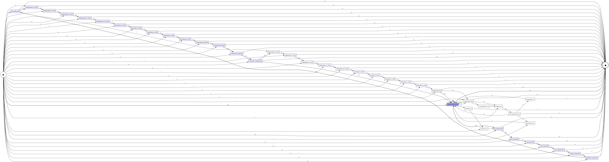
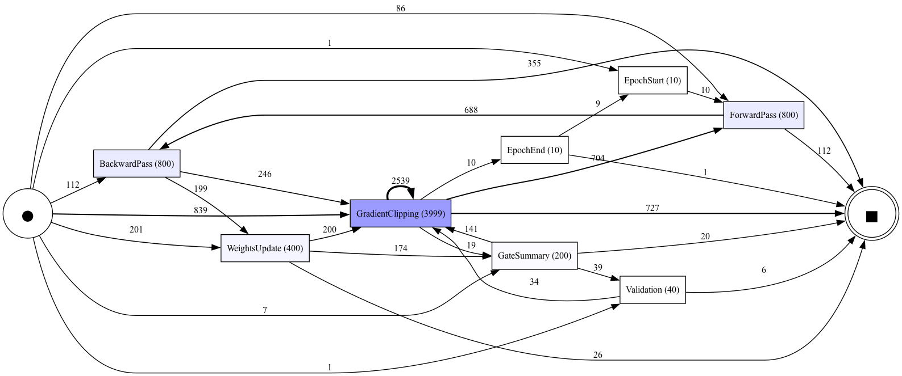
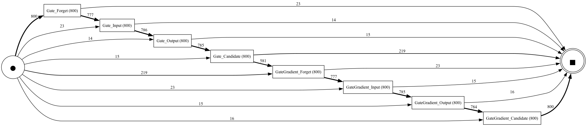
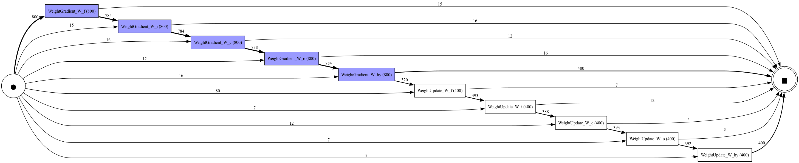

# LSTM Model Training and Process Mining

This repository contains an implementation of a Long Short-Term Memory (LSTM) neural network for sequence modeling tasks. The model is designed for educational and experimental purposes and assumed to use in proccess mining tasks

## Process Model Visualizations

The training process is visualized using Directly Follows Graphs (DFG) generated from the XES event logs. These visualizations show the flow of events during LSTM training at different levels of detail.

### Complete Training Process

*Figure 1: Complete Directly Follows Graph showing all events in the LSTM training process. This visualization captures the full workflow including forward passes, backward passes, weight updates, gate operations, and training monitoring events.*

### Main Training Events

*Figure 2: High-level view of the main training events. This simplified process model focuses on the core training loop: EpochStart → ForwardPass → BackwardPass → WeightsUpdate → EpochEnd, with additional monitoring events like GradientClipping, GateSummary, and Validation.*

### LSTM Gate Operations

*Figure 3: Detailed view of LSTM gate operations during training. This visualization shows the internal workings of the LSTM gates (Forget, Input, Output, Candidate) and their gradient computations, revealing how the model learns to control information flow through the memory cells.*

### Weight Update Process

*Figure 4: Weight matrix update patterns during training. This process model shows how different weight matrices (W_f, W_i, W_c, W_o, W_hy) and bias vectors are updated throughout the training process, providing insights into the learning dynamics of each component.*

## XES Logger and Training Process Logging

During training, a custom XES logger (`XESLogger`) is used to record high-level events and statistics about the training process in the [XES (eXtensible Event Stream)](https://www.xes-standard.org/) format.

### What is logged?
- **Each epoch** is logged as a separate trace in the XES file.
- **Events** are logged at key points during training, including:
  - Forward and backward passes
  - Weights updates
  - Gradient clipping
  - Gate summary statistics
  - Sampling from the model
  - Learning rate decay
  - Validation loss checks
  - Plateau detection (when validation loss stops improving)
  - Gradient explosion detection
  - Early stopping (when training would stop due to lack of improvement)
  - End of epoch summary

### Structure of the `.xes` file
- **Trace**: Each trace corresponds to one epoch of training.
  - Trace attributes: `epoch`, `iterations` (number of iterations in the epoch)
- **Events**: Each event has a type (`concept:name`) and a set of attributes. Example event types and attributes:

| Event Type           | Key Attributes                                      | Description                                  |
|----------------------|-----------------------------------------------------|----------------------------------------------|
| EpochStart           | epoch, total_epochs, iterations_per_epoch, dataset_size | Start of training epoch                      |
| ForwardPass          | iteration, loss, grad_norm, learning_rate           | Forward pass through the model               |
| BackwardPass         | iteration, grad_norm                                | Backward pass (gradient computation)         |
| WeightsUpdate        | iteration, weight_change_norm, update_category      | Model weights updated                        |
| GradientClipping     | iteration, grad_norm, threshold                     | Gradients clipped due to large norm          |
| GateSummary          | iteration, forget_mean, input_mean, output_mean     | Summary stats for LSTM gates                 |
| Sampling             | iteration, temperature, sample_text                 | Model generates a sample                     |
| LearningRateDecay    | iteration, old_lr, new_lr, reason                   | Learning rate reduced                        |
| Validation           | iteration, validation_loss                          | Validation loss computed                     |
| EarlyStoppingCheck   | iteration, triggered, patience_counter, best_val_loss| Check for early stopping                     |
| PlateauDetected      | iteration, patience_counter, best_val_loss, current_val_loss | Plateau in validation loss detected |
| GradientExplosion    | iteration, grad_norm, threshold, loss               | Gradient norm exceeded threshold             |
| EarlyStopping        | iteration, reason, best_val_loss                    | Early stopping triggered                     |
| EpochEnd             | final_loss, final_grad_norm                         | End of epoch summary                         |

### Literature
- Model architecture is written using the following [article](https://colah.github.io/posts/2015-08-Understanding-LSTMs/) and this [article](https://karpathy.github.io/2015/05/21/rnn-effectiveness/).
- Some pieces of code taken from this [repo](https://github.com/karpathy/char-rnn/blob/master/model/LSTM.lua)